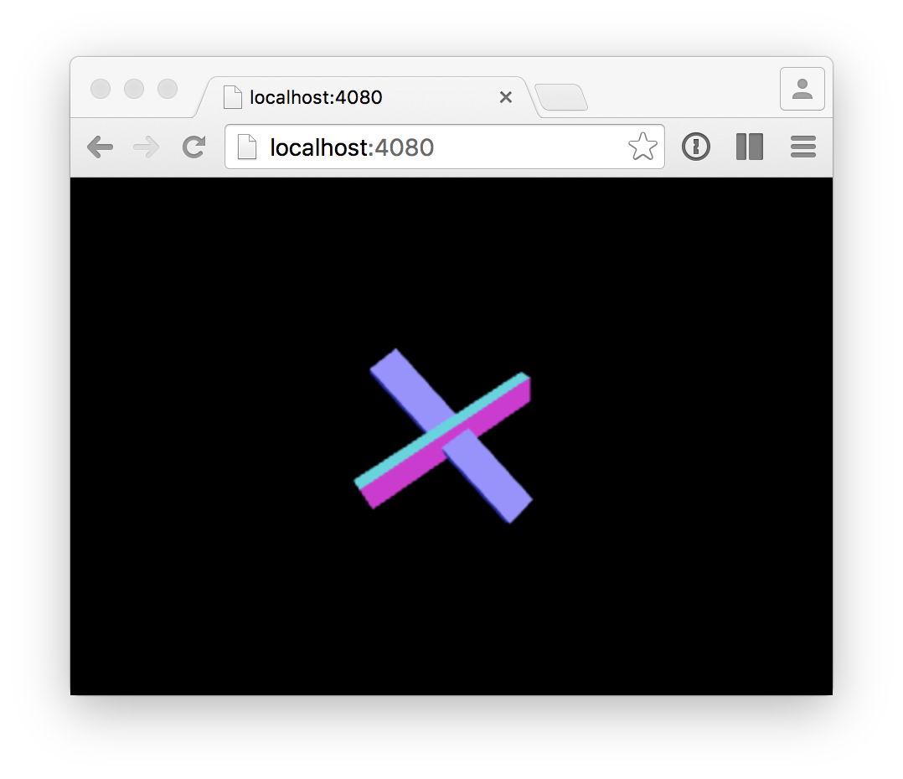

# Visualize HTML5 `deviceorientation` using three.js and socket.io

1. Listen to [deviceorientation](https://developer.mozilla.org/en-US/docs/Web/API/Detecting_device_orientation) event when available (only mobile devices)
2. Push the orientation data to the central server using [socket.io](http://socket.io/)
3. Broadcast the orientation of multiple devices
4. Visualize the orientation using [three.js](http://threejs.org/)

## Getting Started

```
npm install
bower install
npm start
```

Connect with your local web browser **and** at least one mobile browser to `http://<YOUR-IP>:4080`.

Now move your device(s). See:


